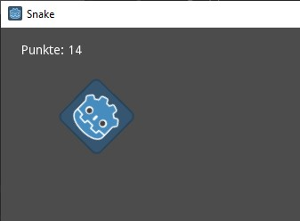

# Stundenblog Snake Game

## Informatikstunde Nr. 1 (10.12.2019)

Heute erfahre ich, dass ich ein neues Projekt entwickeln oder and meinem alten weiter arbeiten kann. Dabei entscheide ich mich dazu ein neues Projekt anzufangen. Ich entscheide mich nach Überlegungen und kleinen Recherechen dafür ein Spiel zu programmieren, das Snake ähnelt.

## Informatikstunde Nr. 2 (11.12.2019)

Derzeit überlege ich noch, welche Programmiersprache ich in den kommenden Wochen nutzen werde. Dabei betrachte ich C++ und Java, wobei ich mich schließlich für Java entscheide, weil diese sich für Einsteiger eignet. Nach einem Download dieser Programmiersprache, richte ich mir das Programm ein und beginne mit meiner Suche nach Features, welche ich in das Spiel einbauen möchte.

## Informatikstunde Nr. 3 (18.12.2019)

Diese Unterrichtsstunde habe ich meine Suche nach Features fortgesetzt, wobei ich auf einige Optionen gestoßen bin. Außerdem habe ich neue Methoden durch Tutorials erlernt.

https://github.com/janbodnar/Java-Snake-Game/blob/master/src/com/zetcode/Board.java

## Informatikstunde Nr. 4 (15.01.2020)

Heute überlege ich mir, wie ich Java nutze, um meine Wünsche und Vorstellungen zu verwirklichen. Dabei möchte ich zumindest teilweise von einer einfachen 2D-Spielfläche abweichen. Ich würde gerne den Spieler "drehen" und mithilfe eines Zooms die Bewegung in den dreidimensionalen Raum vortäuschen. Als Hintergrund hätte ich gerne eine Visualisierung der Mandelbrotmenge.

## Informatikstunde Nr. 5 (16.01.2020)

Heute kann ich leider nur am Handy an meinem Stundenblog arbeiten, denn zwei Computer sind ausgefallen. Dennoch schaue ich mir Videos an, in welchem ich wichtige Befehle und Code-Stränge entnehmen kann. 
[Video 1](https://www.youtube.com/watch?v=91a7ceECNTc),
[Video 2](https://www.youtube.com/watch?v=OZYVfVxB81s)

Zudem schaue ich mir eine Erklärung der Mandelbrotmenge an.

## Informatikstunde Nr. 6 (22.01.2020)

Ich habe außerhalb des Informatikunterrichts ein wenig an meinem Projekt weitergearbeitet. Da fiel mir auf, dass ich mich mit Java nicht ganz so schnell vertaut machen konnte, wie ich es mir erhofft hatte. Ich habe mir deshalb überlegt, mein Projekt nun doch mit der [Godot Engine](https://godotengine.org/) umzusetzen, da ich mit diesem Programm bereits mein erstes Projekt fertiggestellt hatte. Zudem habe ich das Gefühl das Godot mehr für solche Art von Programmierungen geschaffen ist. Das Spielprinzip wird dabei das gleiche bleiben.

## Zuhausestunde Nr. 1 (01.02.2020)

Zuerst wollte ich dafür sorgen, dass das Anzeigen der Mandelbrotmenge im Hintergrund des Spielfeldes funktioniert. Dafür müsste ich mir einen eigenen Shader schreiben, und da ich das bislang noch nie gemacht hatte, habe ich mir dafür ein [Video](https://www.youtube.com/watch?v=kv3uGJq12fc) angeschaut. Dabei habe ich gelernt, dass der Zoom, so wie ich in mir bislang vorgestellt hatte, nicht uneingeschränkt möglich ist. Ich muss dafür weiter recherchieren und mir unter Umständen eine Alternative überlegen.

## Informatikstunde Nr. 7 (05.02.2020)

Ich möchte mit meinem Snake vom klassischen Rastermuster für die Bewegung abweichen und dem Spieler erlauben sich relativ frei zu bewegen. Dafür habe ich mithilfe der [Godot-Dokumentation](https://docs.godotengine.org/en/3.1/tutorials/2d/2d_movement.html) eine Funktion eingebaut, die den Spieler der Maus dauerhaft folgen lässt.

## Informatikstunde Nr. 8 (06.02.2020)

Während ich mich mit Java auseinandergesetzt hatte, habe ich die Objektorientierte Programmieren näher kennengelernt. Dies ist auch in Godot möglich und ich möchte diese Möglichkeit ausschöpfen. Es soll nicht nur ein Objekt geben, das dem Spieler Punkte gibt, sobald es berührt wird, sondern auch "Power-Ups", die z.B. die Geschwindigkeit des Spielers erhöhen.
Also erstelle ich mir zuerst eine Klasse, die ich "Pickup" nenne. Sie enthält die grundlegenden Eigenschaften der Objekte mit denen der Spieler interagieren kann. Nun kann ich in meine "Point"-Klasse `extends Pickup` schreiben, um die Eigenschaften der Pickup-Klasse zu übernehmen. Jetzt muss ich nur überschreiben, was bei der Kollision mit dem Spieler passieren soll.

## Informatikstunde Nr. 9 (12.02.2020)

Nachdem ich jetzt die Grundbausteine hatte, habe ich die "Point"-Objekte fertiggestellt. Anschließend habe ich ein Text-Element zum Bildschirm hinzugefügt, das die aktuelle Punktzahl anzeigt.

## Informatikstunde Nr. 10 (13.02.2020)

Ich beginne heute damit "Power-Ups" in mein Spiel einzufügen, was für mehr Spielspaß sorgen soll. Diese kann ich ebenfalls von der "Pickup"-Klasse abstammen lassen, um weniger Arbeit zu haben.

## Informatikstunde Nr. 11 (14.02.2020)

Heute kümmere ich mich darum, dass der spielbare Bereich größer wird, wenn die "Schlange" des Spielers eine gewisse Größe erreicht. Da der Spieler zu jedem Zeitpunkt das gesamte Spielfeld sehen soll, löse ich das über einen Zoom der Kamera.

## Informatikstunde Nr. 12 (11.03.2020)

Heute habe ich Hindernisse eingebaut, die zufällig im Spielbereich erscheinen. Wenn der Spieler mit einem solchen Hindernis kollidiert, ist das Spiel vorbei.

## Coronaferien

Da der Unterricht bis zu den Osterferien unterbrochen wird, werde ich von nun an zuhause arbeiten. Da habe ich mich weiter mit der Problematik der Fraktaldarstellung beschäftigt. Ich habe dabei ein Repository auf Github gefunden, das sowohl die Mandelbrot-Menge als auch die Julia-Menge implementiert. Bei der Julia-Menge lässt sich die Berechnung bei einer guten Performance während des Spielens dynamisch verändern, sodass sich der Hintergrund des Spielfeldes dauerhaft ändern könnte. Ich werde also in den nächsten Tagen mich damit beschäftigen. Außerdem möchte ich noch ein kleines Menü einbauen, damit das Spiel nicht sofort beginnt.