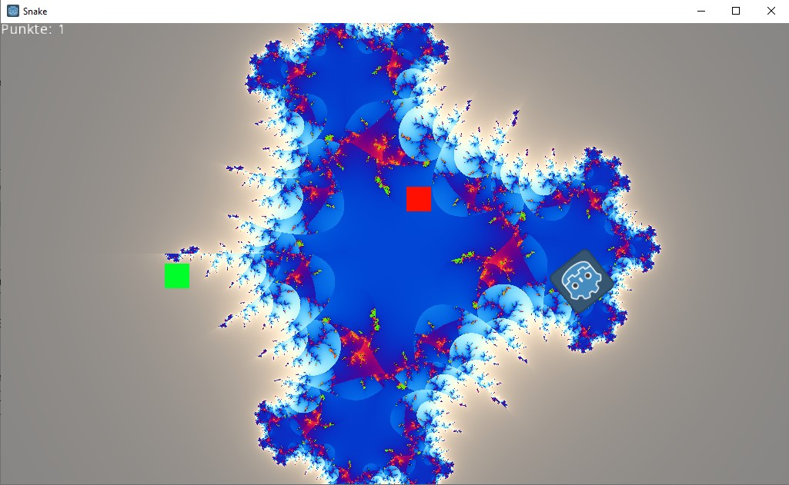

# Projektseite "Snake Game"

## Spieler

```lua
extends KinematicBody2D

var Grundgeschwindigkeit = 200

var Bewegung = Vector2()

func _physics_process(_delta):
	var MausPosition = get_global_mouse_position()
	look_at(MausPosition) # Rotiert den Spieler
	Bewegung = Vector2(Grundgeschwindigkeit, 0).rotated(rotation) # Rotiert den Vektor, sodass die x-Komponente, nach vorne zeigt
	move_and_slide(Bewegung)
```

Hier ist die Bewegung des Spielers programmiert. Er hat eine Grundgeschwindigkeit von 200 Einheiten, ist also immer in Bewegung. Außerdem soll er sich immer zu Maus hin ausrichten, damit er sich dorthin bewegen kann.

```lua
	if(position.distance_to(MausPosition) < 1):
		get_tree().quit()
```

Dann wird geschaut, ob die Position des Spieler etwa identisch mit der Position der Maus ist, weil der Spieler dann mit sich selbst kollidieren würde. Deshalb wird dort das Spiel auch beendet.

```lua
	if(get_slide_count() > 0):
		var Kollision = get_slide_collision(0)
		if(Kollision):
			if(Kollision.collider is Sammelbares):
				Kollision.collider.Kollision()

	var Sammelbares = preload("res://Sammelbares/pickup.gd")
```

Hier findet nun eine Kollisionsabfrage mit anderen Objekten in der Welt statt. Mit der Sammelbares-Variable und dem "is Sammelbares" stelle ich sicher, dass das Kollisionsobjekt auch die Kollision-Funktion besitzt. Ansonsten würde es zu Abstürzen kommen. 

## Spielfeld

Der meiste Code des Spielfeldes ist für die Darstellung des Julia-Menge. Er stammt aus diesem Repository [Link](https://github.com/tinmanjuggernaut/godot-fractal-art). Ich habe den Code nur leicht angepasst, um ihn passend einsetzten zu können.


Jetzt wird der Hintergrund des Spielfeldes immer geändert, wenn der Spieler bewegt wird.

```lua

var timer = Timer.new()

var point = preload("res://Sammelbares/point.tscn")
var feind = preload("res://Sammelbares/collisionobject.tscn")
var powerup = preload("res://Sammelbares/collectible.tscn")

var RNG = RandomNumberGenerator.new()

var sizex = OS.get_window_size().x
var sizey = OS.get_window_size().y

func _on_timer_timeout():
	var instance
	RNG.randomize()
	var x = RNG.randi_range(0, sizex)
	var y = RNG.randi_range(0, sizey)
	RNG.randomize()
	var object = RNG.randi_range(0, 2)
	if(object == 0):
		instance = point.instance()
	elif(object==1):
		instance = feind.instance()
	else:
		instance = powerup.instance()
	
	instance.position = Vector2(x, y)
	get_node("..").add_child(instance)

func _ready() -> void:
	get_viewport().connect("size_changed", self, "update_aspect_ratio")
	update_aspect_ratio()
	timer.connect("timeout",self,"_on_timer_timeout") 
	add_child(timer)
	timer.start()
```

Das ist der Auschnitt vom Code des Spielfelds, der für das erstellen der Items verantwortlich ist. Mithilfe eines Zufallsgenerator wird die Position und Art des Items bestimmt und anschließend in der Welt platziert. Diese Funktion wird mit einem Timer immer wieder aufgerufen.

## Punkteanzeige

```lua
extends RichTextLabel

var Punkte = 0

func score(menge = 1):
	Punkte += menge
	set_text("Punkte: " + str(Punkte))
```


## "Sammelbares"

### Feind

```lua
extends "res://pickup.gd"

func Kollision():
	get_tree().quit()
```

Kollidiert man mit einem Feind, wird das Spiel beendet. Er wird mit einer roten Box dargestellt.

### Punkt

Die Punkte sind das wichtigste sammelbare Objekt. Sie sorgen dafür, dass die Spielerkette vergrößert wird. Die Logik dafür befindet sich allerdings im Spieler. Hier sorgen wir nur dafür, dass die Punktezahl erhöht wird und das Objekt gelöscht wird.

```lua
extends "res://pickup.gd"

func Kollision():
	get_node(@"/root/G/RichTextLabel").score(1)
	get_node("..").queue_free()
```

### "Powerup"



Das Powerup ist nicht wirklich hilfreich, aber es sieht cool es, wenn es den Hintergrund verändert. Es hat eine blaue Box als Textur.

```lua
extends "res://pickup.gd"

func Kollision():
	var power = rand_range(1,5)
	get_node("/root/G/Fractal").material.set_shader_param("power", power)
	get_node("..").queue_free()
```

Es funktioniert mithilfe eines zufallsbasierten Wertes, der für einen Parameter der Fraktal-Visualisierung eingesetzt wird.
Die Punkteanzeige ist ein RichTextLabel und hat somit einen Text, der angezeigt wird. Sie hat nur eine Funktion mit der die Punktanzahl erhöht wird und der Text mit der neuen Zahl aktualisiert wird. 
